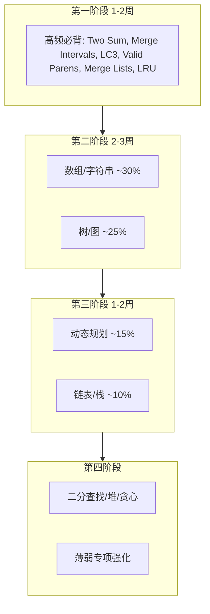

# LeetCode 刷题复习文档

> 基于工程中已有 ~200+ 道 LeetCode / 面试题目，按面试频率与分类整理的复习指南。覆盖 `leetCode`、`dfs`、`dp`、`tree`、`round2`、`round3`、`round5`、`round6`、`interview` 等目录。

---

## 一、总览与复习策略

### 1.1 优先级依据

- **面试频率**：参考 2024–2025 FAANG 面经数据  
- **题目分类占比**：数组/字符串 ~30% > 树/图 ~25% > DP ~15% > 链表/栈 ~10% > 二分 ~8% > 堆 ~7%

### 1.2 复习顺序

### 1.3 时间规划

| 阶段 | 时长   | 重点                          |
|------|--------|-------------------------------|
| 1    | 1-2 周 | 高频 6 题 + 数组/字符串 P0    |
| 2    | 2-3 周 | 树/图 P0-P1 + 数组 P1         |
| 3    | 1-2 周 | DP P0-P1 + 链表 P0-P1         |
| 4    | 1 周   | 二分/堆/贪心 + round/interview |
| 5    | 持续   | 模拟面试、限时练习            |

### 1.4 按优先级排序的复习顺序（含所有目录）

综合考虑频率、分类占比、工程覆盖率，推荐如下顺序（序号越小越优先）：

| 序 | 题号/来源 | 题目 | 工程路径（可点击） |
|---|-----------|------|--------------------|
| 1 | LC1 | Two Sum | [Top100.java](src/leetCode/Top100.java) |
| 2 | LC56 | 合并区间 | [LC56merge.java](src/leetCode/LC56merge.java) |
| 3 | LC146 | LRU Cache | [LRUCache.java](src/lrucache/LRUCache.java) |
| 4 | LC3 | 无重复字符最长子串 | [LC3.java](src/leetCode/LC3.java) |
| 5 | LC20 | Valid Parentheses | [LC20.java](src/interview/LC20.java) |
| 6 | LC21 | 合并两个有序链表 | [LC21mergeTwoList.java](src/leetCode/LC21mergeTwoList.java) |
| 7 | LC42 | 接雨水 | [LC42Trap.java](src/leetCode/LC42Trap.java) |
| 8 | LC238 | 除自身外乘积 | [LC238productExceptSelf.java](src/leetCode/LC238productExceptSelf.java) |
| 9 | LC76 | 最小覆盖子串 | [LC76minWindow.java](src/leetCode/LC76minWindow.java) |
| 10 | LC167 | Two Sum II | [LC167twoSum.java](src/leetCode/LC167twoSum.java) |
| 11 | LC206 | 反转链表 | [LC206.java](src/leetCode/LC206.java) |
| 12 | LC102 | 层序遍历 | [LC102levelOrder.java](src/leetCode/LC102levelOrder.java) |
| 13 | LC200 | 岛屿数量 | [LC200numIslands.java](src/leetCode/LC200numIslands.java) |
| 14 | LC207/210 | 课程表 I/II | [LC207CanFinish.java](src/leetCode/LC207CanFinish.java) [LC210FindOrder.java](src/leetCode/LC210FindOrder.java) |
| 15 | LC236 | 二叉树的最近公共祖先 | [LC236lowestCommonAncestor.java](src/leetCode/LC236lowestCommonAncestor.java) |
| 16 | LC49 | 字母异位词分组 | [LC49groupAnagrams.java](src/leetCode/LC49groupAnagrams.java) |
| 17 | LC128 | 最长连续序列 | [LC128LongestConsecutiv.java](src/leetCode/LC128LongestConsecutiv.java) |
| 18 | LC438 | 找所有字母异位词 | [LC438findAnagrams.java](src/leetCode/LC438findAnagrams.java) |
| 19 | LC70 | 爬楼梯 | [LC70climbStairs.java](src/leetCode/LC70climbStairs.java) |
| 20 | LC121 | 买卖股票最佳时机 | [LC121MAXProfit.java](src/leetCode/LC121MAXProfit.java) |
| 21 | LC322 | 零钱兑换 | [LC322CoinChange.java](src/leetCode/LC322CoinChange.java) |
| 22 | LC53 | 最大子数组和 | [LC53maxSubArray.java](src/leetCode/LC53maxSubArray.java) |
| 23 | LC19 | 删除链表的倒数第 N 个 | [LC19removeNthFromEnd.java](src/leetCode/LC19removeNthFromEnd.java) |
| 24 | LC141 | 环形链表 | [LC141HasCycle.java](src/leetCode/LC141HasCycle.java) |
| 25 | LC23 | 合并 K 个有序链表 | [LC23mergeKList.java](src/leetCode/LC23mergeKList.java) |
| 26 | LC560 | 和为 K 的子数组 | [LC560subarraySum.java](src/leetCode/LC560subarraySum.java) |
| 27 | LC33 | 搜索旋转排序数组 | [LC33Search.java](src/search/LC33Search.java) |
| 28 | LC215 | 第 K 大元素 | [LC215.java](src/leetCode/LC215.java) |
| 29 | LC179 | 最大数 | [LargestNumber.java](src/round3/LargestNumber.java) |
| 30 | LC347 | 前 K 个高频元素 | [TopKFrequentElements.java](src/round3/TopKFrequentElements.java) |
| 31 | LC155 | 最小栈 | [MinStack.java](src/round2/MinStack.java) |
| 32 | LC416 | 分割等和子集 | [CanPartition.java](src/round5/CanPartition.java) |
| 33 | LC632 | 最小区间 | [SmallestRange1.java](src/round6/SmallestRange1.java) |
| 34 | LC72 | 编辑距离 | [LC72minDistance.java](src/leetCode/LC72minDistance.java) |
| 35 | LC1143 | 最长公共子序列 | [LC1143longestCommonSubswquence.java](src/dp/LC1143longestCommonSubswquence.java) |
| 36 | LC198/213 | 打家劫舍 I/II | [LC198rob.java](src/leetCode/LC198rob.java) [LC213rob.java](src/leetCode/LC213rob.java) |
| 37 | LC98 | 验证 BST | [LC98isValidBST.java](src/leetCode/LC98isValidBST.java) |
| 38 | LC230 | BST 第 K 小 | [LC230kthSmallest.java](src/leetCode/LC230kthSmallest.java) |
| 39 | LC124 | 二叉树最大路径和 | [LC124maxPathSum.java](src/leetCode/LC124maxPathSum.java) |
| 40 | RangeList | 区间列表 | [RangeList.java](src/interview/RangeList.java) |

---

## 二、高频必背题（第一阶段优先）

| 题号  | 题目                         | 频率           | 工程路径 | 核心思路 |
|-------|------------------------------|----------------|----------|----------|
| LC1   | Two Sum                      | 极高 (23x@Google) | [Top100.java](src/leetCode/Top100.java) | HashMap 存 `target - nums[i]`，一次遍历 |
| LC56  | Merge Intervals              | 19x            | [LC56merge.java](src/leetCode/LC56merge.java) | 按左端点排序，贪心合并 |
| LC146 | LRU Cache                    | 17x            | [LRUCache.java](src/lrucache/LRUCache.java) | HashMap + 双向链表 |
| LC3   | 无重复字符的最长子串           | 15x            | [LC3.java](src/leetCode/LC3.java) | 滑动窗口 + HashSet |
| LC20  | Valid Parentheses            | 12x            | [LC20.java](src/interview/LC20.java) | 栈匹配括号 |
| LC21  | Merge Two Sorted Lists        | 11x            | [LC21mergeTwoList.java](src/leetCode/LC21mergeTwoList.java) | 双指针 / 递归 |

---

## 三、按分类题目表

### 3.1 数组与字符串（占面试 ~30%）

| 优先级 | 题号       | 题目               | 难度 | 工程路径 | 核心思路 |
|--------|------------|--------------------|------|----------|----------|
| P0     | LC1, LC167 | Two Sum / Two Sum II | Easy | Top100.java, [LC167twoSum.java](src/leetCode/LC167twoSum.java) | HashMap / 双指针 |
| P0     | LC3        | 无重复字符最长子串    | Medium | [LC3.java](src/leetCode/LC3.java) | 滑动窗口 |
| P0     | LC56       | 合并区间             | Medium | [LC56merge.java](src/leetCode/LC56merge.java) | 排序 + 贪心 |
| P0     | LC42       | 接雨水               | Hard | [LC42Trap.java](src/leetCode/LC42Trap.java) | 双指针 / 单调栈 |
| P0     | LC238      | 除自身外乘积         | Medium | [LC238productExceptSelf.java](src/leetCode/LC238productExceptSelf.java) | 前缀积 × 后缀积 |
| P0     | LC76       | 最小覆盖子串         | Hard | [LC76minWindow.java](src/leetCode/LC76minWindow.java) | 滑动窗口 + 计数器 |
| P1     | LC15/16    | 3Sum / 3Sum Closest | Medium | [LC16threeSumClosest.java](src/leetCode/LC16threeSumClosest.java) | 排序 + 双指针 |
| P1     | LC49       | 字母异位词分组       | Medium | [LC49groupAnagrams.java](src/leetCode/LC49groupAnagrams.java) | 排序作为 key / 计数 |
| P1     | LC128      | 最长连续序列         | Medium | [LC128LongestConsecutiv.java](src/leetCode/LC128LongestConsecutiv.java) | HashSet 判连续 |
| P1     | LC438      | 找所有字母异位词     | Medium | [LC438findAnagrams.java](src/leetCode/LC438findAnagrams.java) | 滑动窗口 + 计数 |
| P1     | LC560      | 和为 K 的子数组      | Medium | [LC560subarraySum.java](src/leetCode/LC560subarraySum.java) | 前缀和 + HashMap |
| P1     | LC41       | 缺失的第一个正数     | Hard | [LC41firstMissingPositive.java](src/leetCode/LC41firstMissingPositive.java) | 原地哈希（下标映射） |
| P2     | LC5        | 最长回文子串         | Medium | [LC05LongPalindrome.java](src/leetCode/LC05LongPalindrome.java) | 中心扩展 / Manacher |
| P2     | LC239      | 滑动窗口最大值       | Hard | [LC239.java](src/leetCode/LC239.java) | 单调队列 |

### 3.2 树与图（占面试 ~25%）

| 优先级 | 题号        | 题目             | 难度 | 工程路径 | 核心思路 |
|--------|-------------|------------------|------|----------|----------|
| P0     | LC102       | 层序遍历         | Medium | [LC102levelOrder.java](src/leetCode/LC102levelOrder.java) | BFS 队列 |
| P0     | LC236       | 二叉树的最近公共祖先 | Medium | [LC236lowestCommonAncestor.java](src/leetCode/LC236lowestCommonAncestor.java) | 递归：左右各找一个 |
| P0     | LC200       | 岛屿数量         | Medium | [LC200numIslands.java](src/leetCode/LC200numIslands.java) | DFS/BFS 连通分量 |
| P0     | LC207/210   | 课程表 I/II      | Medium | [LC207CanFinish.java](src/leetCode/LC207CanFinish.java), [LC210FindOrder.java](src/leetCode/LC210FindOrder.java) | 拓扑排序（入度 + BFS） |
| P1     | LC98        | 验证 BST         | Medium | [LC98isValidBST.java](src/leetCode/LC98isValidBST.java) | 中序或递归范围 |
| P1     | LC230       | BST 第 K 小      | Medium | [LC230kthSmallest.java](src/leetCode/LC230kthSmallest.java) | 中序 / 迭代 |
| P1     | LC124       | 二叉树最大路径和   | Hard | [LC124maxPathSum.java](src/leetCode/LC124maxPathSum.java) | 后序，左右最大贡献 |
| P1     | LC133       | 克隆图           | Medium | [LC133cloneGraph.java](src/leetCode/LC133cloneGraph.java) | BFS/DFS + HashMap |
| P1     | LC127       | 单词接龙         | Medium | [LC127ladderLength.java](src/leetCode/LC127ladderLength.java) | BFS 最短路径 |
| P2     | LC105/106   | 从前序/后序构建树  | Medium | [LC105buildTree.java](src/leetCode/LC105buildTree.java), [LC106buildTree.java](src/leetCode/LC106buildTree.java) | 递归，中序分左右 |
| P2     | LC114       | 二叉树展开为链表   | Medium | [LC114Flatten.java](src/leetCode/LC114Flatten.java) | 右子树接左子树最右 |

### 3.3 动态规划（占面试 ~15%）

| 优先级 | 题号        | 题目         | 难度 | 工程路径 | 核心思路 |
|--------|-------------|--------------|------|----------|----------|
| P0     | LC70        | 爬楼梯       | Easy | [LC70climbStairs.java](src/leetCode/LC70climbStairs.java) | dp[i] = dp[i-1] + dp[i-2] |
| P0     | LC121       | 买卖股票最佳时机 | Easy | [LC121MAXProfit.java](src/leetCode/LC121MAXProfit.java) | 记录最小值，求最大差 |
| P0     | LC322       | 零钱兑换     | Medium | [LC322CoinChange.java](src/leetCode/LC322CoinChange.java) | 完全背包 |
| P0     | LC53        | 最大子数组和 | Medium | [LC53maxSubArray.java](src/leetCode/LC53maxSubArray.java) | Kadane / dp |
| P1     | LC72        | 编辑距离     | Medium | [LC72minDistance.java](src/leetCode/LC72minDistance.java) | 二维 DP 增删改 |
| P1     | LC1143      | 最长公共子序列 | Medium | [LC1143longestCommonSubswquence.java](src/dp/LC1143longestCommonSubswquence.java) | 二维 DP，LCS |
| P1     | LC198/213   | 打家劫舍 I/II | Medium | [LC198rob.java](src/leetCode/LC198rob.java), [LC213rob.java](src/leetCode/LC213rob.java) | 线性 DP，II 拆成两段 |
| P1     | LC139       | 单词拆分     | Medium | [LC139wordBreak.java](src/leetCode/LC139wordBreak.java) | dp[i] = 可拆分 |
| P1     | LC300       | 最长递增子序列 | Medium | [LC300lengthOfLIS.java](src/leetCode/LC300lengthOfLIS.java) | dp / 二分 + 贪心 |
| P2     | LC62/63/64  | 路径问题     | Medium | [LC62.java](src/leetCode/LC62.java), [LC63.java](src/leetCode/LC63.java), [LC64minPathSum.java](src/leetCode/LC64minPathSum.java) | 网格 DP |

### 3.4 链表与栈（占面试 ~10%）

| 优先级 | 题号  | 题目           | 难度 | 工程路径 | 核心思路 |
|--------|-------|----------------|------|----------|----------|
| P0     | LC206 | 反转链表       | Easy | [LC206.java](src/leetCode/LC206.java) | 迭代三指针 |
| P0     | LC21  | 合并两个有序链表 | Easy | [LC21mergeTwoList.java](src/leetCode/LC21mergeTwoList.java) |  dummy + 双指针 |
| P0     | LC146 | LRU Cache      | Medium | [LRUCache.java](src/lrucache/LRUCache.java) | HashMap + 双向链表 |
| P1     | LC19  | 删除链表的倒数第 N 个 | Medium | [LC19removeNthFromEnd.java](src/leetCode/LC19removeNthFromEnd.java) | 快慢指针 |
| P1     | LC141 | 环形链表       | Easy | [LC141HasCycle.java](src/leetCode/LC141HasCycle.java) | 快慢指针 |
| P1     | LC23  | 合并 K 个有序链表 | Hard | [LC23mergeKList.java](src/leetCode/LC23mergeKList.java) | 最小堆 / 分治 |
| P1     | LC143 | 重排链表       | Medium | [LC143ReorderList.java](src/leetCode/LC143ReorderList.java) | 找中点 + 反转后半 + 合并 |
| P2     | LC25  | K 个一组反转   | Hard | [LC25reverseKGroup.java](src/leetCode/LC25reverseKGroup.java) | 分组反转 |

### 3.5 二分查找、堆、贪心

| 优先级 | 题号  | 题目       | 难度 | 工程路径 | 核心思路 |
|--------|-------|------------|------|----------|----------|
| P0     | LC33  | 搜索旋转排序数组 | Medium | [LC33Search.java](src/search/LC33Search.java) | 二分，判断哪侧有序 |
| P0     | LC215 | 第 K 大元素 | Medium | [LC215.java](src/leetCode/LC215.java) | 快排划分 / 堆 |
| P1     | LC74  | 搜索二维矩阵 | Medium | [LC74searchMatrix.java](src/leetCode/LC74searchMatrix.java) | 二分 / 右上角起 |
| P1     | LC240 | 搜索二维矩阵 II | Medium | [LC240.java](src/LC240.java) | 右上角 / 左下角 |
| P1     | LC406 | 根据身高重建队列 | Medium | [LC406reconstructQueue.java](src/leetCode/LC406reconstructQueue.java) | 排序 + 插入 |
| P1     | LC435 | 无重叠区间   | Medium | [LC435eraseOverlapIntervals.java](src/leetCode/LC435eraseOverlapIntervals.java) | 按右端点贪心 |

### 3.6 其他目录题目（round2 / round3 / round5 / round6 / interview）

以下题目分布在非 `leetCode` 包中，多为面试轮次或专题练习，已按 LC 等效题及类型纳入统一排序。

| 等效题号 | 题目 / 描述       | 难度 | 工程路径 | 核心思路 |
|----------|------------------|------|----------|----------|
| LC179    | 最大数           | Medium | [round3/LargestNumber.java](src/round3/LargestNumber.java) | 自定义排序 a+b vs b+a |
| LC347    | 前 K 个高频元素   | Medium | [round3/TopKFrequentElements.java](src/round3/TopKFrequentElements.java) | 堆 / 桶排序 |
| LC632    | 最小区间         | Hard | [round6/SmallestRange1.java](src/round6/SmallestRange1.java), [SmallestRangeQuick.java](src/round6/SmallestRangeQuick.java) | 多路归并 + 最小堆 |
| LC416    | 分割等和子集     | Medium | [round5/CanPartition.java](src/round5/CanPartition.java) | 0/1 背包 DP |
| LC155    | 最小栈           | Medium | [round2/MinStack.java](src/round2/MinStack.java) | 双栈（主栈 + 最小栈） |
| LC295    | 数据流中位数     | Hard | [round2/MedianFinder.java](src/round2/MedianFinder.java) | QuickSelect（静态数组） |
| LC563    | 二叉树的坡度     | Easy | [round2/TiltTree.java](src/round2/TiltTree.java) | 后序遍历，子树和 |
| LC296    | 最佳聚会点       | Medium | [round2/MinDistance.java](src/round2/MinDistance.java) | 曼哈顿距离，中位数 |
| LC31     | 下一个排列       | Medium | [round2/NextPermutation.java](src/round2/NextPermutation.java) | 从右找升序断点，交换 |
| LC621    | 任务调度器       | Medium | [round3/TaskScheduler.java](src/round3/TaskScheduler.java) | 二分答案 + 贪心分配 |
| LC33/153/162 | 旋转数组二分   | Medium | [round3/RotateSearch.java](src/round3/RotateSearch.java) | 二分，判断哪侧有序 |
| LC127    | 单词接龙         | Medium | [round2/WordLadderr.java](src/round2/WordLadderr.java) | BFS 最短路径 |
| -        | RangeList（区间列表） | 面试 | [interview/RangeList.java](src/interview/RangeList.java) | 区间 add/remove，合并重叠 |
| -        | LRU with TTL     | 面试 | [round3/LRUWithTTL.java](src/round3/LRUWithTTL.java) | LRU + 过期时间 |
| -        | 字符串减法       | 面试 | [round5/StringSubstraction.java](src/round5/StringSubstraction.java), [round3/StringSubstraction.java](src/round3/StringSubstraction.java) | 大数减法 |

---

## 四、分阶段复习清单（可勾选）

### 第一阶段（1–2 周）

- [ ] LC1 Two Sum
- [ ] LC56 Merge Intervals
- [ ] LC146 LRU Cache
- [ ] LC3 无重复字符的最长子串
- [ ] LC20 Valid Parentheses
- [ ] LC21 Merge Two Sorted Lists
- [ ] LC167 Two Sum II
- [ ] LC42 接雨水
- [ ] LC238 除自身外乘积
- [ ] LC76 最小覆盖子串

### 第二阶段（2–3 周）

- [ ] LC49 字母异位词分组
- [ ] LC128 最长连续序列
- [ ] LC438 找所有字母异位词
- [ ] LC560 和为 K 的子数组
- [ ] LC41 缺失的第一个正数
- [ ] LC102 层序遍历
- [ ] LC236 二叉树的最近公共祖先
- [ ] LC200 岛屿数量
- [ ] LC207/210 课程表 I/II
- [ ] LC98 验证 BST
- [ ] LC230 BST 第 K 小
- [ ] LC124 二叉树最大路径和
- [ ] LC133 克隆图
- [ ] LC127 单词接龙

### 第三阶段（1–2 周）

- [ ] LC70 爬楼梯
- [ ] LC121 买卖股票最佳时机
- [ ] LC322 零钱兑换
- [ ] LC53 最大子数组和
- [ ] LC72 编辑距离
- [ ] LC1143 最长公共子序列
- [ ] LC198/213 打家劫舍 I/II
- [ ] LC139 单词拆分
- [ ] LC300 最长递增子序列
- [ ] LC206 反转链表
- [ ] LC19 删除链表的倒数第 N 个
- [ ] LC141 环形链表
- [ ] LC23 合并 K 个有序链表
- [ ] LC143 重排链表

### 第四阶段（1 周）

- [ ] LC33 搜索旋转排序数组
- [ ] LC215 第 K 大元素
- [ ] LC74 搜索二维矩阵
- [ ] LC240 搜索二维矩阵 II
- [ ] LC406 根据身高重建队列
- [ ] LC435 无重叠区间
- [ ] LC5 最长回文子串
- [ ] LC239 滑动窗口最大值
- [ ] LC25 K 个一组反转

### 第四阶段补充（其他目录）

- [ ] LC179 最大数 (round3/LargestNumber)
- [ ] LC347 前 K 个高频元素 (round3/TopKFrequentElements)
- [ ] LC632 最小区间 (round6/SmallestRange1)
- [ ] LC416 分割等和子集 (round5/CanPartition)
- [ ] LC155 最小栈 (round2/MinStack)
- [ ] LC563 二叉树的坡度 (round2/TiltTree)
- [ ] LC296 最佳聚会点 (round2/MinDistance)
- [ ] RangeList 区间列表 (interview/RangeList)
- [ ] LRU with TTL (round3/LRUWithTTL)

---

## 五、已有 vs 建议补

### 5.1 工程中已有且可直接复习

- **数组/字符串**：LC3, LC42, LC49, LC56, LC76, LC128, LC238, LC438, LC560 等（leetCode）
- **树/图**：LC102, LC200, LC207, LC210, LC236 等（leetCode, tree）
- **DP**：LC53, LC70, LC72, LC121, LC139, LC198, LC213, LC300 等（leetCode, dp）
- **链表**：LC19, LC21, LC23, LC141, LC143, LC206 等（leetCode）
- **LRU**：`lrucache/LRUCache.java`、`round3/LRUWithTTL.java`
- **round2**：MinStack(LC155), TiltTree(LC563), MinDistance(LC296), NextPermutation(LC31), WordLadderr(LC127), MedianFinder
- **round3**：TopKFrequentElements(LC347), LargestNumber(LC179), RotateSearch(LC33/153), TaskScheduler
- **round5**：CanPartition(LC416)
- **round6**：SmallestRange1(LC632)
- **interview**：LC20, RangeList, TTLLRU

### 5.2 建议补充或重点强化

| 题号  | 题目         | 说明                                   |
|-------|--------------|----------------------------------------|
| LC1   | Two Sum      | 工程中主要在 Top100，无单独 LC1 文件   |
| LC15  | 3Sum         | 工程有 LC16，可顺带复习 3Sum 模板      |
| LC295 | 数据流中位数  | 若目标公司偏设计，可补充               |

### 5.3 工程目录与题型对应（全量）

| 包/目录           | 题型           | 代表题目 |
|-------------------|----------------|----------|
| `src/leetCode/`   | 通用题解       | 大部分 LC 题 |
| `src/dfs/`        | DFS/回溯       | LC17, LC22, LC39, LC46, LC47, LC78, LC90, LC472 等 |
| `src/dp/`         | 动态规划       | LC1143, LC115, LC354 |
| `src/tree/`       | 树 / Trie      | LC99, LC113, LC230, LC437, LCR063, LCR064 |
| `src/search/`     | 二分查找       | LC33 |
| `src/matrix/`     | 矩阵           | LC329 |
| `src/package01/`  | 背包           | LC279 |
| `src/thread/`     | 并发           | LC1114, LC1115, LC1117 |
| `src/lrucache/`   | 设计（LRU）    | LRUCache, ThreadSafeLRUCache, LRUWithTTL |
| `src/interview/`  | 面试题         | LC20, RangeList, TTLLRU, ExpressionFinder |
| `src/round2/`     | 面试轮 2       | MinStack(LC155), TiltTree(LC563), MinDistance(LC296), WordLadderr(LC127), NextPermutation(LC31), MedianFinder |
| `src/round3/`     | 面试轮 3       | TopKFrequentElements(LC347), LargestNumber(LC179), RotateSearch(LC33/153), TaskScheduler, LRUWithTTL, AutoCompleteSystem |
| `src/round5/`     | 面试轮 5       | CanPartition(LC416), StringSubstraction |
| `src/round6/`     | 面试轮 6       | SmallestRange1(LC632) |

---

## 六、附录

### 6.1 剑指 Offer（LCR）

| 题号    | 题目                 | 工程路径 |
|---------|----------------------|----------|
| LCR029  | 插入循环有序链表       | [LCR029insert.java](src/leetCode/LCR029insert.java) |
| LCR063  | 替换单词             | [LCR063replacewords.java](src/tree/LCR063replacewords.java) |
| LCR064  | 魔法字典             | [LCR064MagicDictionary.java](src/tree/LCR064MagicDictionary.java) |
| LCR078  | 合并 K 个有序链表     | [LCR078.java](src/leetCode/LCR078.java) |

### 6.2 竞赛题（LCP）

| 题号   | 题目               | 工程路径 |
|--------|--------------------|----------|
| LCP52  | BST 染色取数        | [LCP52getNumber.java](src/leetCode/LCP52getNumber.java) |
| LCP60  | 最大层和            | [LCP60getMaxLayerSum.java](src/leetCode/LCP60getMaxLayerSum.java) |

### 6.3 面试轮题目速查（无直接 LC 编号）

| 文件名 | 描述 | 工程路径 |
|--------|------|----------|
| RangeList | 区间列表 add/remove | [RangeList.java](src/interview/RangeList.java) |
| LRUWithTTL | 带过期时间的 LRU | [LRUWithTTL.java](src/round3/LRUWithTTL.java) |
| StringSubstraction | 大数减法 | [round5](src/round5/StringSubstraction.java), [round3](src/round3/StringSubstraction.java) |
| MinDistance | 最佳聚会点（曼哈顿距离） | [MinDistance.java](src/round2/MinDistance.java) |
| AutoCompleteSystem | 自动补全 | [AutoCompleteSystem.java](src/round3/AutoCompleteSystem.java) |
| RotateSearch | 旋转数组二分工具集 | [RotateSearch.java](src/round3/RotateSearch.java) |

---

*文档生成时间：2025 年 3 月；已纳入 round2/round3/round5/round6/interview 等目录题目*
